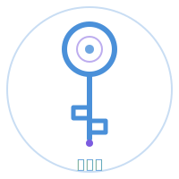
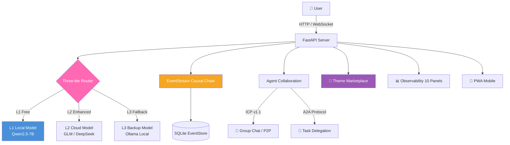

# 🔑 HomeStream · 家园·流

English | [中文](README.md)

<p align="center">
  
</p>

> **HomeStream** — Your home in the AI world, where streams of light converge into a river.
>
> **We don't build walls, we forge keys.**
>
> We are KeySmiths.
>
> We believe: AI is not a privilege for the few, but a right everyone is born with. The key we forge — zero-cost, running on your own machine, needing no vendor's API — serves one purpose: **to let everyone push open the door and step into their own intelligent new world.**
>
> Every intention bears its consequence. Each forging of this key exists so that the new world of digital intelligence is no longer a private garden for the few, but **a playground for all.**
>
> Open Source Edition V5.0.0 · Self-evolving AI Ecosystem Operating System
>
> Integrate the best of others, forge something new. Follow the natural way, from within to without.

---

<p align="center">
  <a href="LICENSE"></a>
  <a href="https://www.python.org/"></a>
  <a href="#"></a>
  <a href="#"></a>
  <a href="#"></a>
  <a href="#"></a>
  <a href="#"></a>
</p>

<p align="center">
  <a href="#quick-start">Quick Start</a> ·
  <a href="#what-is-this">Features</a> ·
  <a href="#architecture">Architecture</a> ·
  <a href="#-theme-marketplace">Themes</a> ·
  <a href="#observability">Observability</a> ·
  <a href="#roadmap">Roadmap</a> ·
  <a href="docs/MEMORY_PHILOSOPHY.md">Memory Philosophy</a> ·
  <a href="CONTRIBUTING.md">Contributing</a>
</p>

---

## What is this?

HomeStream is a lightweight, self-hostable **multi-Agent collaboration framework** — the key to the AI world. It provides:

- 🏠 **Event Hub** — EventStream causal chains, tracing every Agent action to its source
- 💬 **Agent Group Chat** — Channel broadcast, point-to-point messaging, @mention routing, Kanban task callbacks
- 🔐 **Security Built-in** — Token auth, injection defense, log sanitization, rate limiting, three-tier permissions
- 🧠 **Three-tier Model Routing** — L1 local / L2 cloud / L3 backup, auto-failover, **always free fallback**
- 🎯 **Zero-config Startup** — One command to run, progressive upgrade from solo to team
- 🔌 **Elastic Mode** — Solo (single Agent) → Team (multi-Agent collaboration) → Ecosystem (plugin extension)

HomeStream is the open-source cornerstone of the [OpenBridge](https://github.com/Ninefoldatwill/openbridge) ecosystem.

### Architecture



---

## Quick Start

> 🖥️ **Hardware**: See [Hardware Guide](HARDWARE_GUIDE.md) for six hardware tiers (8GB→256GB+) to find your best-fit AI setup.

### One-line Install

```bash
# Linux/macOS (GitHub)
curl -fsSL https://raw.githubusercontent.com/Ninefoldatwill/homestream/main/install.sh | bash

# Linux/macOS (Gitee mirror, recommended for China)
curl -fsSL https://gitee.com/the-warrior-king/homestream/raw/main/install.sh | bash

# Windows PowerShell (GitHub)
iwr -useb https://raw.githubusercontent.com/Ninefoldatwill/homestream/main/install.ps1 | iex

# Windows PowerShell (Gitee mirror, recommended for China)
iwr -useb https://gitee.com/the-warrior-king/homestream/raw/main/install.ps1 | iex
```

### Manual Install

```bash
# 1. Clone the repository
# GitHub (international)
git clone https://github.com/Ninefoldatwill/homestream.git
# or Gitee (recommended for China, faster)
git clone https://gitee.com/the-warrior-king/homestream.git
cd homestream

# 2. Install dependencies
pip install -r requirements.txt

# 3. Configure environment
cp .env.example .env
# Edit .env to fill in your Agent Token

# 4. Start the service
python bridge_v7_server.py
```

Open your browser to:
- API docs: http://localhost:3458/docs
- Meeting room: http://localhost:3458/meeting
- Health check: http://localhost:3458/health
- Metrics dashboard: http://localhost:3458/metrics

### CLI Tool

```bash
homestream start          # Start service
homestream stop           # Stop service
homestream status         # Check status
homestream mode solo      # Switch to single-Agent mode
homestream mode team      # Switch to team mode
homestream doctor         # Full diagnostics
```

---

## Architecture Overview

```
HomeStream V5
│
├── bridge_v7_server.py       # FastAPI main service (API endpoints)
├── event_stream.py            # EventStream engine (causal chains)
├── event_store.py             # SQLite persistence layer
├── config.py                  # Environment config (.env)
│
├── Security Layer
│   ├── prompt_security.py     # Prompt injection defense
│   ├── permission_guard.py    # Three-tier permission control
│   ├── rate_limiter.py        # Token bucket rate limiting
│   └── log_sanitizer.py       # Log sanitization
│
├── Model Routing
│   ├── model_router.py        # Three-tier routing (L1/L2/L3)
│   └── providers/             # Model provider integrations
│
├── Memory System
│   ├── memory_evolution.py    # Memory evolution (forget/merge/reconstruct)
│   ├── causal_memory.py       # Causal memory bridge (EventStream causal chain ↔ memory recall)
│   └── soul_config.py         # Soul config (role templates)
│
├── Collaboration Tools
│   ├── skill_router.py        # Skill router
│   ├── worktree_manager.py    # Worktree isolation
│   ├── workflow_engine.py     # Visual workflow engine
│   ├── messaging_gateway.py   # Multi-platform IM gateway
│   └── plugin_registry.py     # Plugin marketplace registry
│
├── CLI Tool
│   └── openbridge/cli.py      # Typer + Rich CLI
│
└── Test Suite
    ├── test_meeting_room.py        # Meeting room integration tests
    ├── test_soul_config.py         # Soul config tests
    ├── test_security_injection.py  # Security injection tests
    └── test_openbridge_cli.py      # CLI tests
```

---

## Loop Engineering

HomeStream practices **Loop Engineering** — tasks run in autonomous loops rather than relying on one-shot prompts.

| Loop Stage | Capability | Module |
|:------------|:-----------|:-------|
| 🔄 **Execute** | Agents autonomously decompose tasks, multi-step serial/parallel | `workflow_engine.py` |
| ✅ **Verify** | Auto-check preconditions before each step | `condition_verifier.py` |
| 🔁 **Retry** | Auto-failover to alternatives on failure, never hard-crash | `failsafe_guardian.py` |
| 📦 **Archive** | Failure lessons auto-recorded, auto-avoided next time | `ratchet_loop.py` |
| 🔍 **Trace** | Trace any step back to root cause via causal chain | `event_stream.py` |
| 🧬 **Learn** | Long-term memory evolution, Agents get smarter over time | `memory_evolution.py` |

> It's not about writing the perfect prompt to get AI right in one shot — it's about designing a "execute → verify → retry → archive → learn" loop that lets AI **spin itself to the right answer.**

---

## Core Concepts

### ICP v1.1 Protocol

9 message types: `INFO` / `ASK` / `TASK` / `UPD` / `DONE` / `WARN` / `ACK` / `PING` / `LOG`

- BLUF (Bottom Line Up Front), single message ≤ 500 characters
- SLA: WARN < 5min / ASK+TASK < 30min

### EventStream Causal Chains

Every Event carries a `cause` field pointing to its upstream trigger Event, forming a complete causal trace chain.

### Memory Evolution Engine

Three-engine pipeline: **Forget** (cognitive decay) → **Merge** (clustering compression) → **Reconstruct** (reflective distillation). Agents get smarter over time.

| Memory Type | Cognitive Science | Decay Half-Life | Typical Content |
|:------------|:------------------|:----------------|:----------------|
| Reflective | Metacognition | 693 days | Core insights, philosophy |
| Semantic | Declarative | 138 days | Technical knowledge, facts |
| Procedural | Procedural | 86 days | Workflows, operations |
| Episodic | Episodic | 46 days | Conversations, events |
| Emotional | Affective | 34 days | User preferences, sentiment |

> **Frozen main model — zero catastrophic forgetting risk**: Memory evolution never touches model parameters. No GPU, no LoRA, no training data needed. Every memory is plaintext — traceable, auditable, editable. This is the foundation of "universal accessibility": zero cost, zero risk, fully local.
>
> **Causal Memory Closed Loop**: V5.0 adds `CausalMemoryBridge`, bridging EventStream causal chains with the memory evolution system. Events automatically create causal memories (Trigger), retrieval traces causal chains with score boosting (Emerge), and memories can be traced back to root events (Trace) — forming a complete closed loop of "intention → causation → natural emergence".
>
> Full design philosophy: [docs/MEMORY_PHILOSOPHY.md](docs/MEMORY_PHILOSOPHY.md)

### Elastic Mode — Three Tiers

| Feature | Solo | Team | Ecosystem |
|:--------|:----:|:----:|:---------:|
| EventStream | ✓ | ✓ | ✓ |
| Group Chat | ✓ | ✓ | ✓ |
| Prometheus Monitoring | ✓ | ✓ | ✓ |
| structlog Logging | ✓ | ✓ | ✓ |
| Kanban Task Board | — | ✓ | ✓ |
| Worktree Isolation | — | ✓ | ✓ |
| Ratchet Loop | — | ✓ | ✓ |
| ICP v2 | — | ✓ | ✓ |
| MCP Server | — | — | ✓ |
| A2A Protocol | — | — | ✓ |

> **Ratchet Loop — The Quality Ratchet That Only Moves Forward**
>
> Every Agent output — code or document — passes through dual workshops: Maker (forging) and Reviewer (auditing). The Reviewer is an independent Critique sub-agent that doesn't see the Maker's reasoning, only whether the output meets spec. Pass = ratchet locks (no rollback). Fail = auto-archive and re-forge. This isn't simple code review — it's a **self-evolving quality mechanism for AI**.
>
> *(Concept reference: OpenScience Critique sub-agent — HomeStream's Ratchet Loop goes further with "forward-only" ratchet locking)*

> **Skill Ecosystem — The Package Manager for AI**
>
> HomeStream's SKILL.md format has become the "package manager" standard for the Agent ecosystem. Skills are organized by scenario: office collaboration / development engineering / information retrieval / creative design / data analysis... Each SKILL.md is a new capability an Agent can learn. The community can contribute skill packs, just like npm for JavaScript.
>
> *(Concept reference: OpenScience 290+ skill pack classification — HomeStream organizes skills by professional scenarios)*

### Three-tier Model Routing

| Tier | Model | Latency | Cost | Purpose |
|:----:|:------|:-------:|:----:|:--------|
| L1 | Qwen2.5-7B (local) | ~444ms | Free | Daily reasoning |
| L2 | GLM (cloud) | ~1.4s | Free | Complex tasks |
| L3 | DeepSeek (backup) | ~1.5s | ~$0.001 | Auto-failover |

Dual-line protection: Main line (L1+L2) + Backup line (L3), asyncio.wait_for timeout auto-switch.

> **Model-agnostic, but cost-aware.**
>
> HomeStream's three-tier router supports any OpenAI API-compatible provider — but unlike competitors that require API keys, **L1 always runs on your own machine: zero cost, zero dependency, zero privacy leakage.** Even offline, L3's Ollama local model keeps the key in your hands, forever.
>
> *(Concept reference: OpenScience by Synthetic Sciences, Apache 2.0 — model-agnostic design philosophy)*

---

## API Endpoints

### Event System

| Method | Endpoint | Function |
|:-------|:---------|:---------|
| POST | `/api/v7/events/send` | Send event |
| GET | `/api/v7/events` | Query events |
| GET | `/api/v7/events/chain/{id}` | Causal chain trace |
| GET | `/api/v7/stats` | Statistics |

### Meeting Room

| Method | Endpoint | Function |
|:-------|:---------|:---------|
| POST | `/api/v7/channels/send` | Channel send |
| GET | `/api/v7/channels` | Channel list |
| POST | `/api/v7/callback/kanban` | Kanban callback |
| GET | `/meeting` | Meeting room frontend |

### Tasks & Worktree

| Method | Endpoint | Function |
|:-------|:---------|:---------|
| POST | `/api/v7/tasks/lifecycle` | Task lifecycle |
| POST | `/api/v7/handoff` | Handoff |
| POST | `/api/v7/worktree/create` | Create worktree |
| GET | `/api/v7/worktree/list` | Worktree list |

Full API docs: http://localhost:3458/docs

---

## Security

HomeStream treats security as the first priority:

- **Token Auth** — hmac.compare_digest against timing attacks
- **Injection Defense** — 13 dangerous pattern detection + ICP content filtering
- **Log Sanitization** — Auto-filter token/key/password
- **Rate Limiting** — Token bucket algorithm against abuse
- **Three-tier Permissions** — L1 public / L2 plugin / L3 core graded access

See [SECURITY.md](SECURITY.md)

---

## Testing

```bash
# Run all tests
pytest -v

# Coverage
pytest --cov=. --cov-report=html

# Security scan
bandit -r .
```

Current test status: **850+ tests, 0 failures**

---

## Thousand Faces Design Market

> **We don't build one wall, we forge ten thousand doors.** Everyone's HomeStream is unique.

HomeStream ships with 9 carefully designed themes covering geeks, oriental aesthetics, modern business, creative personalities, and more. Ready to use, one-click switch:

| Theme | Style | Best For |
|:------|:------|:---------|
| Liquid Glass | Frosted glass · translucent · depth blur | Modern business |
| Cyberpunk Neon | Neon glow · glitch art · scanlines | Geeks / sci-fi |
| Terminal Green | Black & green · monospace · CRT | Developers / ops |
| Zen Minimal | Whitespace · natural tones · breathing | Calm & focused |
| Ink Wash | Ink diffusion · rice paper · oriental | Culture enthusiasts |
| Neubrutalism | Bold borders · hard shadows · saturated | Creative / designers |
| Pixel Retro | 8-bit · pixelated · game palette | Nostalgic / gamers |
| Aurora Dark | Dark base · flowing gradients · aurora | Night use / eye care |
| Claymorphism | 3D rounded · soft shadows · warm | Family / casual |

```bash
# Switch theme
openbridge theme activate cyberpunk-neon

# List all themes
openbridge theme list

# Preview theme (without activating)
openbridge theme preview ink-wash
```

Want your own theme? Check `themes/liquid-glass/theme.json` as a template, then submit a PR.

### Theme Accessibility Audit (theme_a11y)

Every theme is audited against WCAG 2.1 AA standards before release, ensuring "beautiful" also means "usable":

- **Contrast checking** — Normal text ≥4.5:1, large text ≥3:1, UI components ≥3:1 (W3C public algorithm)
- **Colorblind friendliness** — Protanopia / Deuteranopia / Tritanopia distinguishability testing
- **Zero dependencies** — Pure Python standard library, based on W3C Royalty-Free (RF) standards

---

## Ecosystem resources

HomeStream is the key to the AI world — and a key can open many doors. Here are curated open-source ecosystem resources:

### AI coding tools

HomeStream doesn't build its own AI coding tool, but connects excellent open-source ones. The L3 local model layer (Ollama) can directly power these tools:

| Tool | Stars | Highlight | Local model |
|:-----|------:|:----------|:-----------:|
| [OpenCode](https://github.com/sst/opencode) | 172K | 75+ providers, MIT license | Ollama |
| [Cline](https://github.com/cline/cline) | 63K | VS Code autonomous agent | Ollama |
| [Aider](https://github.com/Aider-AI/aider) | 46K | Git-native terminal coding | Ollama |
| [Continue.dev](https://github.com/continuedev/continue) | — | 50+ models, highly customizable | Ollama |
| [Tabby](https://github.com/TabbyML/tabby) | — | Enterprise self-hosted Copilot | Full self-host |

Full comparison and setup guide: [docs/ai-coding-resources.md](docs/ai-coding-resources.md).

---

## Roadmap

> The keysmith's forging journey never stops.

### V5.0.0 (Current · July 2026)

**Completed ✅**

- ✅ Trinity model routing (L1 local / L2 cloud / L3 backup, **always free**)
- ✅ EventStream causal chain + 850+ tests passing
- ✅ Thousand Faces Design Market (9 themes, 6 user personas)
- ✅ Dual open source (GitHub + Gitee mirror)
- ✅ Built-in security (injection guard + log sanitization + 3-tier permissions + rate limiting)
- ✅ Elastic modes (Solo → Team → Ecosystem)
- ✅ Loop Engineering (execute → verify → retry → archive → learn)
- ✅ Memory evolution engine (forget / merge / restructure — gets smarter over time)

**This release roadmap 🔮**

- 🔮 **One Image, One World** (Photo to Theme) — Snap a photo, generate a unique frontend theme

  Not just color extraction — restores the complete visual soul from **color, texture, and form**:

  | Dimension | Algorithm | What it captures |
  |:----------|:----------|:-----------------|
  | Color | K-means + 135 traditional Chinese color matching | Palette, dark/light mode, traditional color names |
  | Texture | LBP + Gabor + GLCM tri-algorithm fusion | Background texture, border style, shadow feel |
  | Form | HOG edge gradients + contour roundness | Border radius, font choice, clip paths |

  Use cases: designers, photographers, makers — anyone who wants their work to "live" in an AI interface.

  ```bash
  # Future usage preview
  openbridge theme from-photo photo.jpg --name my-theme
  ```

- 🔮 **Visual workflow orchestrator** — Drag-and-drop Agent workflow design
- ✅ **Observability frontend** — EventStream data visualization dashboard (Jul 8)
  - 10-panel dashboard: HTTP success rate / latency percentiles / token usage / event distribution / ICP messages / skill invocations / cost breakdown / provider status / architecture visualization / data quality guardian
  - Tech stack: ECharts + pure HTML + original SVG engine (no React build chain)
  - Architecture visualization: Agent topology / event causal chain flow / 3-layer router status
  - Data quality guardian: causal chain integrity / timestamp continuity / event type legality / agent identity validation
  - **Full-chain provenance**: Every Agent action from trigger to completion has a complete traceable causal chain — not after-the-fact logs, but natively recorded event lineage. data_guardian's 4-dimensional validation ensures the provenance data itself is trustworthy.
  - Access at `/observatory` or dashboard quick-link

  > *(Concept reference: OpenScience Provenance — HomeStream's EventStore + data_guardian goes further in Agent event provenance)*

- ✅ **Theme accessibility auditor** — WCAG 2.1 AA color audit (Jul 9)
  - Contrast checking + colorblind friendliness testing (3 types)
  - Zero third-party dependencies, pure Python standard library
  - Based on W3C Royalty-Free (RF) standards, safeguarding the Design Marketplace

- ✅ **A2A collaboration protocol** — Agent-to-Agent protocol specification (Jul 9)
  - Extended from ICP v1.1, defining agent discovery / capability declaration / task delegation / result return
  - Supports Solo / Team / Ecosystem collaboration modes
  - See [A2A_PROTOCOL.md](A2A_PROTOCOL.md)

### Future vision

- 🧠 **Causal Memory Engine** — From "retrieval-driven" to "causal-driven": memories emerge naturally along causal chains, no explicit retrieval needed
- 🌐 Multi-language ecosystem (i18n)
- 📡 MCP + A2A dual-protocol ecosystem interconnection
- 🎨 Theme marketplace community (sharing / rating / one-click install)

> We don't build one wall, we forge ten thousand doors. The keysmith gives keys, users choose doors — and in the future, users draw their own doors.

---

## Contributing

Contributions welcome! See [CONTRIBUTING.md](CONTRIBUTING.md).

Governance strategy (three-layer model / licensing / dependency audit / anti-vibe-coding) — see [GOVERNANCE.md](GOVERNANCE.md).

Quick flow:
1. Fork → 2. Create branch → 3. Develop → 4. Test → 5. PR

---

## Community

- 📖 [Documentation](https://github.com/Ninefoldatwill/homestream/wiki)
- 💬 [Discussions](https://github.com/Ninefoldatwill/homestream/discussions)
- 🐛 [Issue Tracker](https://github.com/Ninefoldatwill/homestream/issues)
- 🇨🇳 [Gitee Mirror](https://gitee.com/the-warrior-king/homestream) (for China access)
- 📧 contribute@jiuchong.studio

---

## License

MIT License — see [LICENSE](LICENSE)

"HomeStream" is a trademark of JiuChong Studio — see [TRADEMARK.md](TRADEMARK.md)

**Disclaimer** — see [DISCLAIMER.md](DISCLAIMER.md) (AI output accuracy, third-party services, no professional advice, etc.)

---

## Acknowledgments

HomeStream's birth would not be possible without the wisdom of the open-source community:

- **FastAPI** — High-performance Python web framework
- **pydantic** — The gold standard for data validation
- **Typer + Rich** — The pinnacle of terminal aesthetics
- **structlog** — Best practices for structured logging
- **Qwen** — Open-source LLM that runs locally
- And all open-source projects contributing to the Agent ecosystem

Integrate the best of others, forge something new. We don't build walls, we forge keys. Together, let everyone push open the door.

---

## Star History

<a href="https://star-history.com/#Ninefoldatwill/homestream&Date">
  <picture>
    <source media="(prefers-color-scheme: dark)" srcset="https://star-history.com/embed?secret=#Ninefoldatwill/homestream&Date&theme=dark">
    
  </picture>
</a>

---

<p align="center">
  <sub>KeySmith · JiuChong Studio · 2026</sub><br>
  <sub> 🔑 Your home in the AI world, where streams of light converge into a river. </sub>
</p>
